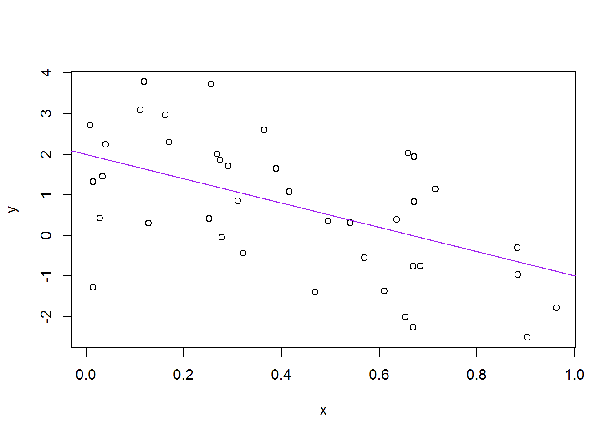

# R Markdown First Test
Zach  
March 17, 2017  

Testing testing testing. 1...2...3...Markdown check. This is an English sentence. Supposedly.


```r
##Toyline code
  #Create some data for a simple scatterplot with trend line
  a <- 2
  b <- -3
  sig_sq <- 2.0
  x <- runif(40)
  y <- a + b * x + rnorm(40, sd = sqrt(sig_sq))
  avg_x <- mean(x)
  
  
  #Print the two 40-observation objects you just created
  x
```

```
##  [1] 0.34658801 0.84045096 0.77785454 0.33283157 0.54383848 0.92303716
##  [7] 0.97228916 0.98245762 0.64241021 0.34827692 0.06764561 0.40925558
## [13] 0.87065971 0.14719008 0.76137540 0.80904207 0.36325841 0.70214648
## [19] 0.02894924 0.10275763 0.85086915 0.59713870 0.92101158 0.82492576
## [25] 0.68452370 0.59871324 0.72253944 0.48076946 0.59568108 0.30150064
## [31] 0.62229781 0.49433535 0.67505571 0.60375659 0.52482163 0.71670921
## [37] 0.29521386 0.39110947 0.39724833 0.41883105
```

```r
  y
```

```
##  [1]  2.3674804  0.2025047  2.7725821  2.3772397  1.8809053 -2.0840772
##  [7] -1.5304858 -0.9349019  0.8702403  1.0428109 -0.2848693  1.9515871
## [13]  0.7017956  3.0794894 -0.3559493  0.7876070  2.7369208  0.4110856
## [19]  3.1276313 -2.0090496 -2.2088639  0.1449470  1.0856541  1.4605112
## [25]  1.6428899 -0.4834078  1.9110313  1.2064784  2.3911879  1.0889052
## [31] -0.5568503  1.5336057  0.8155101 -0.6635042  0.3139324 -0.5340307
## [37]  0.9489577 -2.4731385 -1.5858721  1.2842779
```

```r
  #Print the mean of X to a .txt file
  write(avg_x, "avg_x.txt")
  
  #Create a scatterplot with trendline of X and Y
  plot(x, y)
  abline(a, b, col = "purple")
```

<!-- -->

```r
  #Print scatterplot to external PDF file
  dev.print(pdf, "toy_line_plot.pdf")
```

```
## png 
##   2
```

